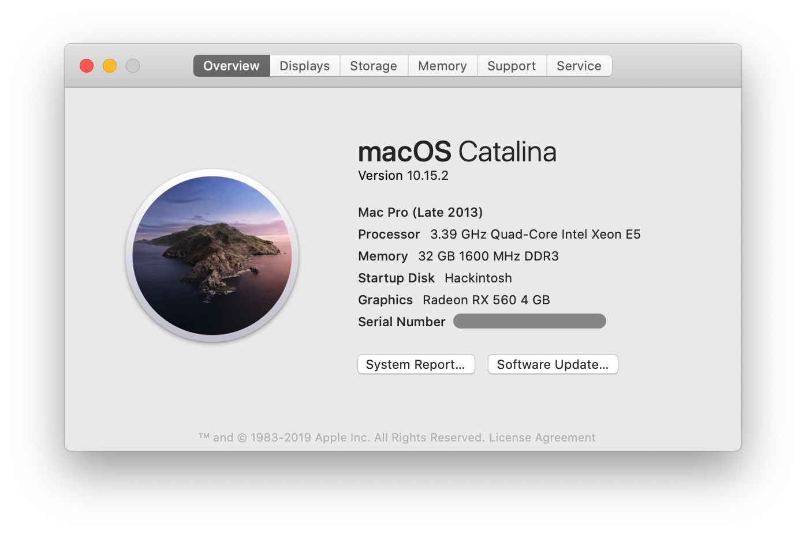

# 基于 Xeno E3-1231 的黑苹果（Hackintosh）组装机安装指南

## 目录
<!-- TOC -->

- [目录](#目录)
- [概述](#概述)
- [更新记录](#更新记录)
  - [2020/0103](#20200103)
  - [2019/0824](#20190824)
- [硬件介绍](#硬件介绍)

<!-- /TOC -->

## 概述


不想上下班背电脑，想放台台式机在公司。考虑需求，需要台内存比较大、同时性能相对比较好的台式机。

整理了下目前手头的硬件发现硬盘、CPU、以及主板都有了，所以就买了主板和显卡，于是就又组装了台黑苹果主机。

之所以叫 `Lenovo P310`，是因为使用的是联想的 P310 机箱，实际上为组装机和联想没有任何直接和间接的关系，望知悉。

## 更新记录

### 2020/0103



更新到 Catalina 10.15.2，更新和精简内核版本，替换使用 VirtualSMC

### 2019/0824

初始化版本，更新到 Mojave 10.14.5


## 硬件介绍

相比前几台黑苹果 [Dell 9020M](https://github.com/mingcheng/dell-optiplex-9020m-hackintosh) 以及 [Lenovo M93P](https://github.com/mingcheng/lenovo-thinkcentre-m93p-hackintosh) 而言，台式机装黑苹果可选择的余地要大很多，而且几乎完美。以下为台式机硬件的主要配置：

```
CPU                         Intel Xeon E3-1231 v3 (8) @ 3.40GHz *
Motherboard                 Gigabyte GA-B85M-DS3H
Memory                      Samsung 32g DDR3 1600 MHz (8g x 4)
Integrated graphics         AMD Radeon RX 560 *
Audio                       Realtek ALC888B (0x0887)
Ethernet                    Realtek RTL8168/8111/8112 Gigabit Ethernet
Wireless network adapter    Broadcom BCM94360 *
Solid State Disk Driver     TOSHIBA THNSNK512GVN8 (512GB)
Hard Disk Driver            WDC WD20SPZX-75UA7T0 (2TB)
```

* Xeno 没有核显，所以使用独立显卡；
* RX 560 为二手市场 300 大洋购买，可能为矿卡，好在目前还未翻车；
* BCM94360 为苹果拆机转接 PCI-E 可以免驱，很省心。

检查项目： 

* 关机/重启【正常】
* 睡眠/唤醒【正常】
* 千兆有线网络【正常】
* DP 4K@60Hz显示器输出【正常】RX560 显卡
* DP 4K + HDMI 1080P 双显示器输出【正常】
* 声音【正常】AppleALC.kext 原生驱动  
* 所有USB 2.0/3.0 和 3.1 接口【正常】
* iCloud/App Store/iMessage【正常】
* 系统资源监控【部分正常】使用 VirtualSMC 以后，GPU 温度无法获取，其他正常
* Wi-Fi、蓝牙【正常】拆机苹果网卡
* Airdop、Handoff【正常】如上

目前(20200102) uptime 最长的时间为 62d，相对来说已经非常稳定，可以用来日常开发使用。

`- eof -`
